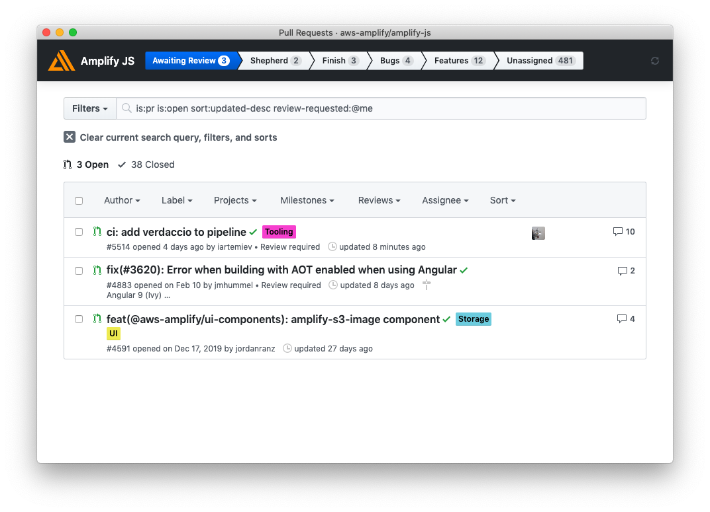

# amplify-js-workflow

Native app for GitHub issue management for Amplify JS

> 

- Styling via [Primary](https://primer.style/css/utilities/box-shadow)
- Bundling via [microbundle](https://github.com/developit/microbundle)
- Packaging via [Nativefier](https://github.com/jiahaog/nativefier)

## Development

1. `yarn install`
1. `yarn dev`

- [ ] `yarn publish` should publish to `@ericclemmons/amplify-js-workflow`
- [ ] Support `npx @ericclemmons/amplify-js-workflow` to run directly
- [ ] Copy `.map` files to package
- [ ] Update icon to use Amplify's
